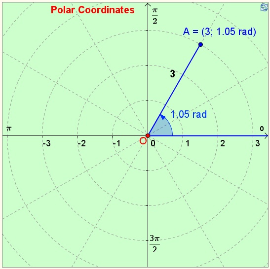

Polar Coordinates
---
Coordinates in a **Polar coordinate system** have two values - radius *r* and angle *a*. This program present us how to add two or more polar coordinates using an overloaded arithmetic operation with conversion to **Cartesian coordinate system** and back. 

---

P.s.: I'll be glad to receive constructive comments about this program, because I could have made a mistakes that I didn't find.

